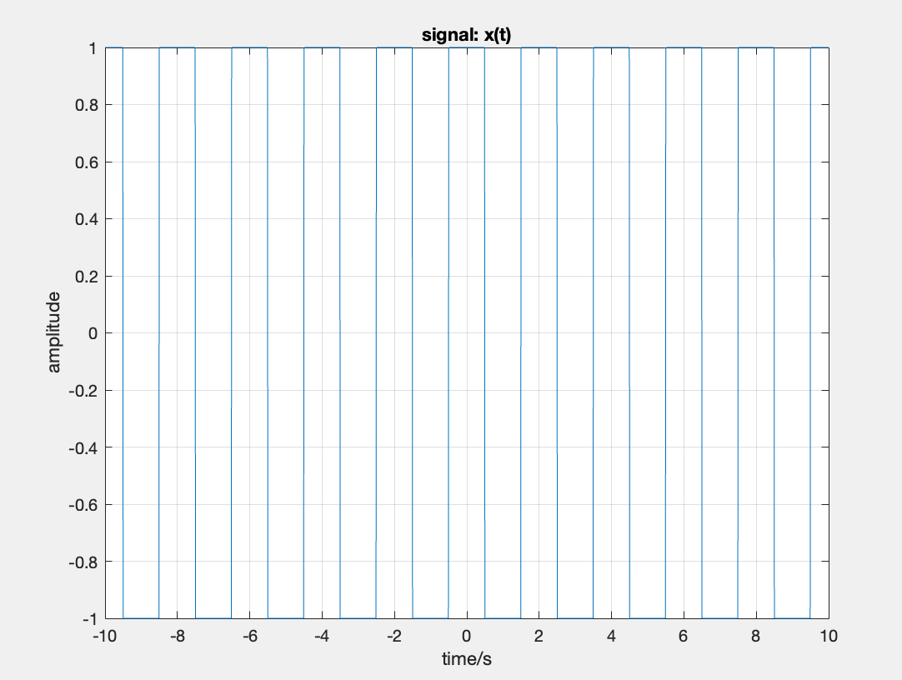
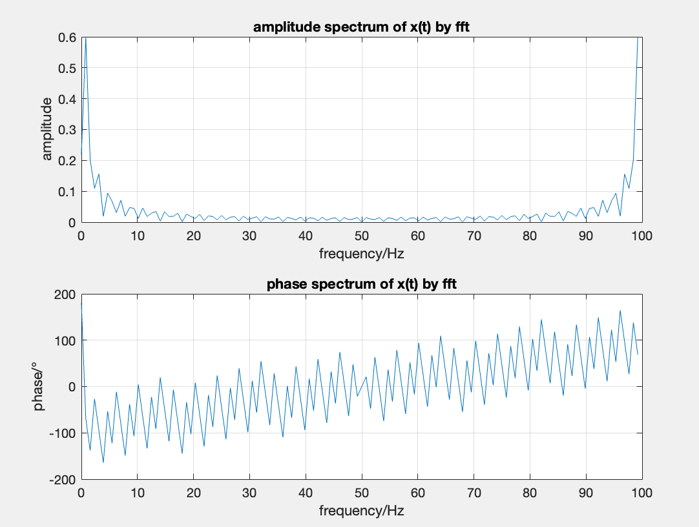
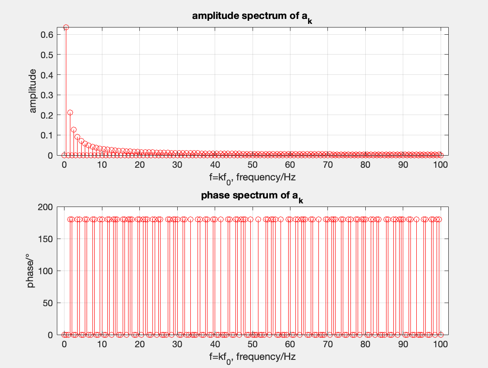
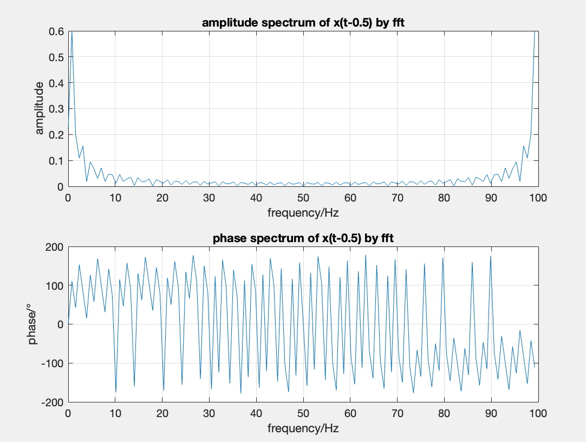

# 实验一

## (1) 写出x(t)的复指数形式和三角函数形式傅里叶级数表示

复指数形式傅里叶级数表示:

$$
x(t)=2\sum_{k=-\infty}^\infty \frac{\sin(k\pi/2)}{k\pi} e^{jk\pi t}-1
$$

三角函数形式傅里叶级数表示:

$$
x(t)=2\sum_{k=-\infty}^\infty\frac{\sin(k\pi/2)}{k\pi}\cos(k\pi t)+2j\sum_{k=-\infty}^\infty\frac{\sin(k\pi/2)}{k\pi}\sin(k\pi t)-1
$$

## (2) 利用“分析公式”求出傅里叶系数

由分析公式计算$a_k$:

$$
\begin{aligned}
a_k
&=\frac{1}{T}\int_{-T/2}^{T/2}x(t)e^{-jk\omega_0 t}dt \\
&=\frac{1}{2}\int_{-1}^{1}x(t)e^{-jk\pi t}dt \\
&=\frac{1}{2}\int_{-1}^{1}[2u(|t|-0.5)-1]e^{-jk\pi t}dt \\
&=\int_{-1}^{1}u(|t|-0.5)e^{-jk\pi t}dt - \int_{-1}^{1}e^{-jk\pi t}dt \\
\end{aligned}\\
$$

需要分类讨论:

$$
a_k=
\begin{cases}
2\frac{\sin(k\pi/2)}{k\pi} & k\neq 0\\
0 & k=0
\end{cases}\\
$$

## (3) 编程，对x(t)进行频谱分析

### I 画出x(t)的时域波形

以信号在有限的时间区间上以$f_s$为采样频率得到的采样点代替.

```matlab
fs = 100;                   % 时域上的采样频率 
t = -10: 1/fs: 10;          % 时域上的采样点
x = square(pi * (t + 0.5)); % 时域上的采样点x对应的值
T = 2;                      % 信号x的周期
f0 = 1 / T;                 % 信号x的周期

% 输出信号x的时域波形
figure(1);
plot(t, x);
title('signal: x(t)');
xlabel('time/s');
ylabel('amplitude');
grid on;
```



### II 画出幅频谱和相频谱

```matlab
% (3)ii
N = 128;                       % 频域上的采样点数量
f = fs * (0: N-1) / N;         % 频域上的采样点
X = fft(x, N) / N;             % 频域上的采样点对应的值
X_A = abs(X);                  % 频域上的采样点对应的幅值
X_theta = angle(X) * 180 / pi; % 频域上的采样点对应的相值

% 输出信号x的幅频谱和相频谱
figure(2);
subplot(2, 1, 1);
plot(f, X_A);
title('amplitude spectrum of x(t) by fft');
xlabel('frequency/Hz');
ylabel('amplitude');
grid on;

subplot(2, 1, 2);
plot(f, X_theta);
title('phase spectrum of x(t) by fft');
xlabel('frequency/Hz');
ylabel('phase/°')
grid on;
```



由于在FFT的信号实际上为一个采样得到的向量, 所以这里被看作一个离散信号, 因此FFT得到的应该是以$f_s$为周期的Fourier变换, 同时可以把图的后半部分当作负频对应的值.

### III 将(2)的理论计算结果与FFT分析结果相对比

```matlab
k = 0: 1: fs/f0;                      % 理论上会遇见的所有k值
ak = 2 * sin(k * pi / 2) ./ (k * pi);
ak(1) = 0;                            % k对应的傅里叶系数ak
fk = k * f0;                          % k对应的频域上的采样点
ak_A = abs(ak);                       % 傅里叶系数ak的幅值
ak_theta = angle(ak) * 180 / pi;      % 傅里叶系数ak的相值

% 输出傅里叶系数ak的幅和相
figure(3);
subplot(2, 1, 1);
stem(fk, ak_A, 'r');
title('amplitude spectrum of a_k');
xlabel('f=kf_0, frequency/Hz');
ylabel('amplitude');
grid on;

subplot(2, 1, 2);
stem(fk, ak_theta, 'r');
title('phase spectrum of a_k');
xlabel('f=kf_0, frequency/Hz');
ylabel('phase/°');
grid on;
```



$a_k$的计算是由数学表达式推来的, 所以是解析的.

在幅频谱中可见, $a_k$不会以$f_s$为周期, 所以和FFT的输出有不同.

在相频谱中可见, 在有限时域内的FFT, 在相频上的误差影响.

## (4) 利用频谱分析的结果，将主要频谱分量叠加，实现信号的重建，并与原信号对比

主要频谱取基波频率的整数倍, 重建实使用matlab的ifft函数(本质为叠加), 在时域上的采样区间也时移-0.5, 其它设置和原信号$x(t)$一致, 得到$x_{re}(t)$信号.

```matlab
N_k = length(k);     % k的数量
N_t = length(t);     % 原x信号在时域上的采样点的数量
X = fft(x, N_t);     % 频域上的采样点对应的值
x_re = ifft(X, N_t); % 重建x信号

% 输出信号x_re的时域波形
figure(4);
plot(t, x_re);
title('signal: x_{re}(t)');
xlabel('time/s');
ylabel('amplitude');
grid on;

```


$x(t)$和$x_{re}(t)$的对比.

## (5) 对x(t-0.5)进行频谱分析，并与原信号的频谱分析结果对比，验证傅里叶级数的时移性质和共轭对称性质推论

```matlab
fs = 100;             % 时域上的采样频率 
t = -10.5: 1/fs: 9.5; % 时域上的采样点
x2 = square(pi * t);  % 时域上的采样点x对应的值
T = 2;                % 信号x的周期
f0 = 1 / T;           % 信号x的周期

X2 = fft(x2, N) / N;             % 频域上的采样点对应的值
X2_A = abs(X2);                  % 频域上的采样点对应的幅值
X2_theta = angle(X2) * 180 / pi; % 频域上的采样点对应的相值

% 输出信号x2的幅频谱和相频谱
figure(5);
subplot(2, 1, 1);
plot(f, X2_A);
title('amplitude spectrum of x(t-0.5) by fft');
xlabel('frequency/Hz');
ylabel('amplitude');
grid on;

subplot(2, 1, 2);
plot(f, X2_theta);
title('phase spectrum of x(t-0.5) by fft');
xlabel('frequency/Hz');
ylabel('phase/°')
grid on;
```



验证时移性质: 有图可见, 幅频谱几乎一致, 相频谱出现了垂直平移(这里因为相角限制在了$-180\le\theta<180$之间, 所以图上不是很明显), 符合时移性质.

验证共轭对称性质: $x(t)$本身为实信号, 所以$x^ *(t)=x(t)$, 得到的$a^ *_{-k}=a_{k}$, 符合共轭对称性质.
