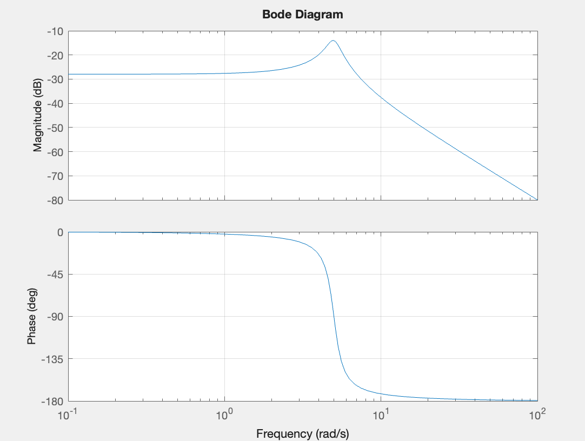
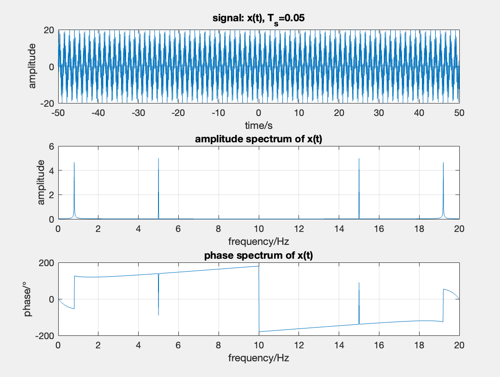
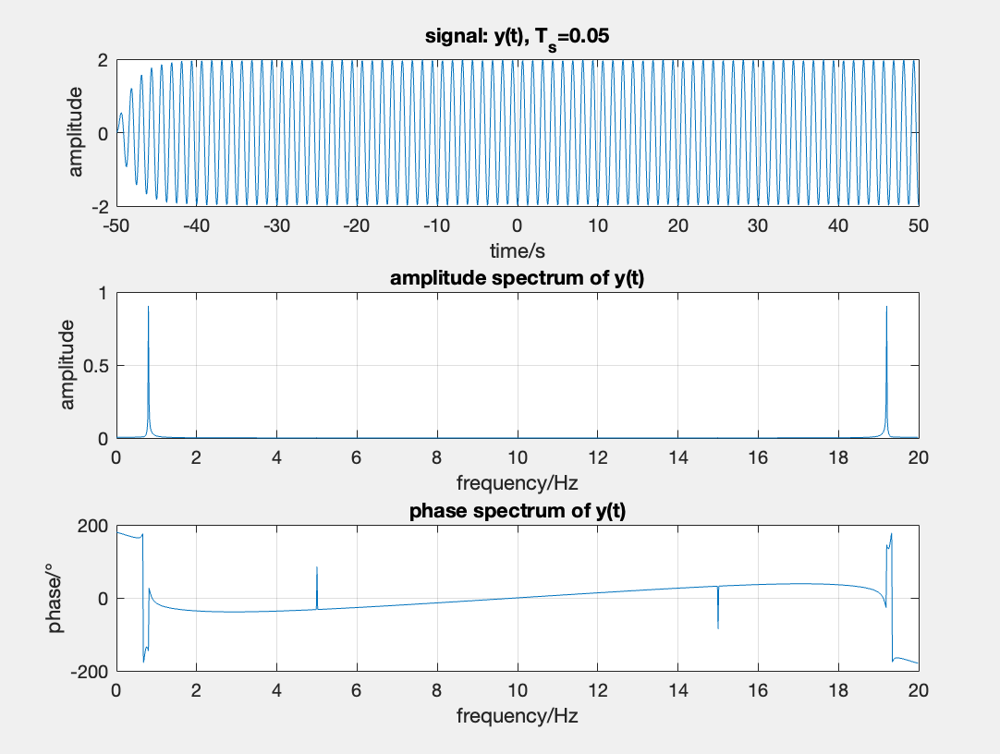
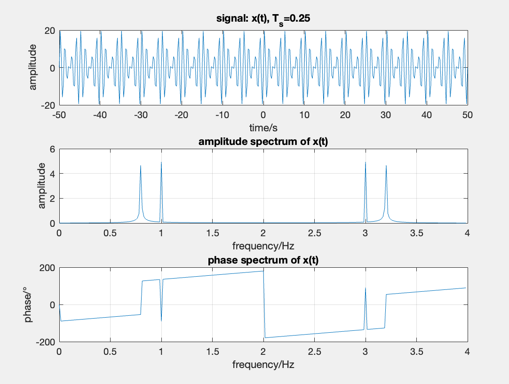
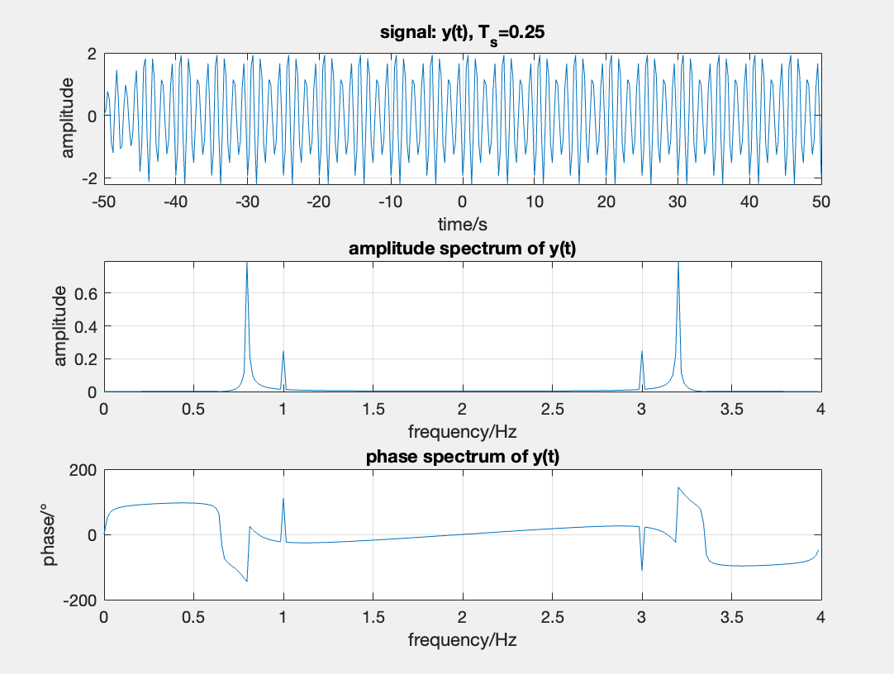
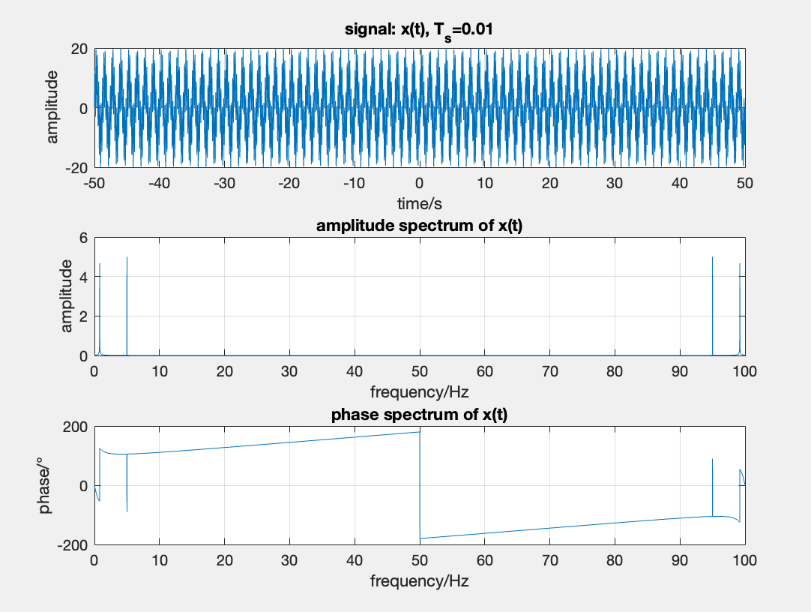
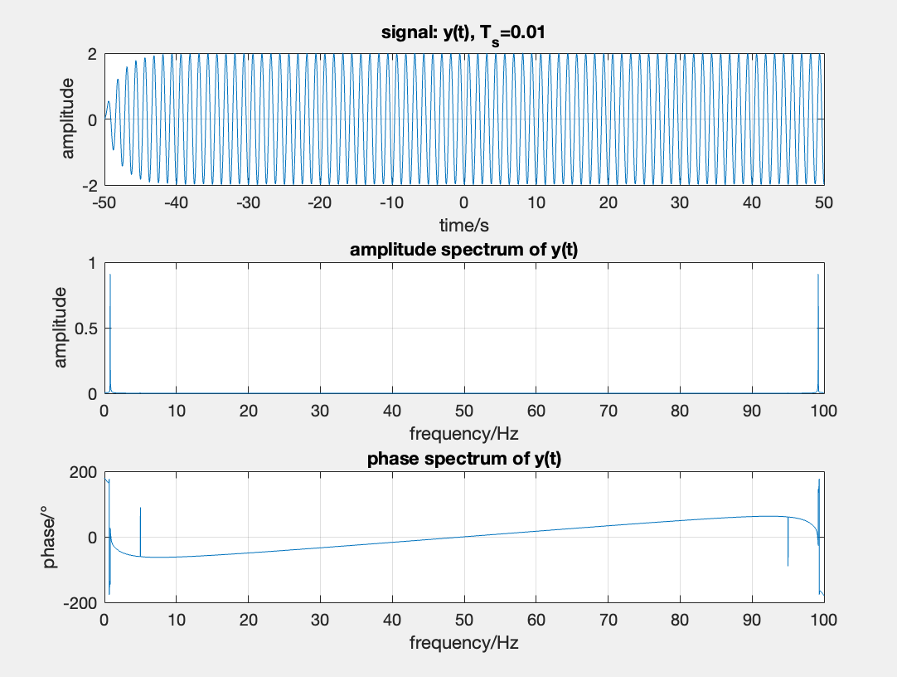

# 实验二实验报告

给定一个连续LTI系统, $y''(t)+y'(t)+25y(t) = x(t), x(t) = 10[\sin(1.6\pi t)+\sin(10\pi t)]$.

## 理论计算

### (1) 计算系统的幅度响应，判断该系统是哪一类频率选择性滤波器？（低通、高通、带通、带阻）

计算$H(s)$:

$$
\begin{matrix}
y''(t)+y'(t)+25y(t) = x(t) \\
s^2Y(s)+sY(s)+25Y(s) = X(s) \\
H(s) = \frac{Y(s)}{X(s)} = \frac{1}{s^2+s+25} = \frac{1}{(s+\frac12)^2+(\frac32\sqrt{11})^2}
\end{matrix}
$$

可知有$H(s)$有极点在$\frac{-1\pm j3\sqrt{11}}{2}$, 所以通过零极点图发现, 在复平面的虚轴上, $\frac{-1-j3\sqrt{11}}{2}<\omega<\frac{-1+j3\sqrt{11}}{2}$对应的$H(j\omega)$偏大, 所以为低通性滤波器.

### (2) 求系统的输出信号

把信号展开为特征函数的线性组合会更加方便计算:

$$
\begin{matrix}
x(t) = 10[\sin(1.6\pi t)+\sin(10\pi t)] = \frac{10}{2j}[e^{j1.6\pi t}-e^{-j1.6\pi t}+e^{j10\pi t}-e^{-j10\pi t}] \\
y(t) = \frac{10}{2j}[H(j1.6\pi)e^{j1.6\pi t}-H(-j1.6\pi)e^{-j1.6\pi t}+H(j10\pi)e^{j10\pi t}-H(-j10\pi)e^{-j10\pi t}] \\
注意到H(s^*)=H(s)^* \\所以 y(t) = 10[\mathcal{Im}\{H(j1.6\pi)e^{j1.6\pi t}\}+\mathcal{Im}\{H(j10\pi)e^{j10\pi t}\}]
\end{matrix}
$$

## 仿真分析

### (1) 绘制系统的频率响应Bode图

```matlab
num = 1;            % 分子系数
den = [1, 1, 25];   % 分母系数
sys = tf(num, den); % 系统函数

% 输出H的频率响应Bode图
figure(1)
bode(sys);  
grid on;
```



相比PPT这里使用了Matlab自带的bode函数画图(也和老师确认过, 是可以使用的).

### (2) 绘制输入、输出信号的时域波形和频谱，分析和解释滤波过程

这里的滤波过程可以在频域上更好的解释, 在时域上的$y(t)=h(t)*x(t)$, 在频域上为$Y(j\omega)=H(j\omega)\cdot X(j\omega)$, 可以把$H(j\omega)$理解为$X(j\omega)$的幅值, $H(j\omega)$在一些时域上非常小, $X(j\omega)$对应的分量得不到体现; 而$H(j\omega)$在一些时域上非常大, $X(j\omega)$对应的分量被夸大, 进而改变了$X(j\omega)$频率上的权重, 实现了滤波.

### (3) 对输入信号的采样时长改变时，频谱怎样变化？为什么？

#### I 采样频率大于最高频率的两倍

这里的$f_M=5\text{Hz}$, 所以取$T_s=0.05s, f_s=20\text{Hz}$来采样.

```matlab
fs = 20;                                   % 时域上的采样频率, 后面改为4, 100
Ts = 1/fs;                                 % 时域上的采样时长
t = -50: Ts : 50;                          % 时域上的采样点
x = 10*sin(2*pi*0.8*t) + 10*sin(2*pi*5*t); % 时域上的采样点x对应的值
y = lsim(sys, x, t);                       % 时域上的采样点y对应的值

N = fs * 64;           % 频域上的采样点数量
f = fs * (0: N-1) / N; % 频域上的采样点

X = fft(x, N) / N;             % 频域上的采样点X对应的值
X_A = abs(X);                  % 频域上的采样点X对应的幅值
X_theta = angle(X) * 180 / pi; % 频域上的采样点X对应的相值

Y = fft(y, N) / N;             % 频域上的采样点Y对应的值
Y_A = abs(Y);                  % 频域上的采样点Y对应的幅值
Y_theta = angle(Y) * 180 / pi; % 频域上的采样点Y对应的相值
```





可以看出响应信号频率为5Hz的部分几乎看不出来, 此时正常滤波.

#### II 采样时长过大/采样频率过低

由采样定理知道, 采样频率应该信号频率高于信号的最高频率的两倍, 否则会发生混叠, 所以我们实验性地取$T_s=0.25,f_s=4\text{Hz}$.

代码和I中一样, 不再给出.





可以发现混叠导致原本频率为5Hz的部分变为了1Hz, 所以就算经过滤波也无法明显去除, 滤波效果不好.

#### III 采样时长过小/采样频率过高

采样频率过高其实光从滤波效果上是没有任何负面作用的, 唯一的缺点是采样点增加, 计算量增加, 而且需要提高频域上频率精度才可以看出来滤波效果, 也处于此原因, 代码中的N是由fs决定的, 这样是为了增加部分灵活性. 这里取$T_s=0.01s, f_s=100\text{Hz}$

代码和I中一样, 不再给出.





可以看出响应信号频率为5Hz的部分几乎看不出来, 此时正常滤波.
