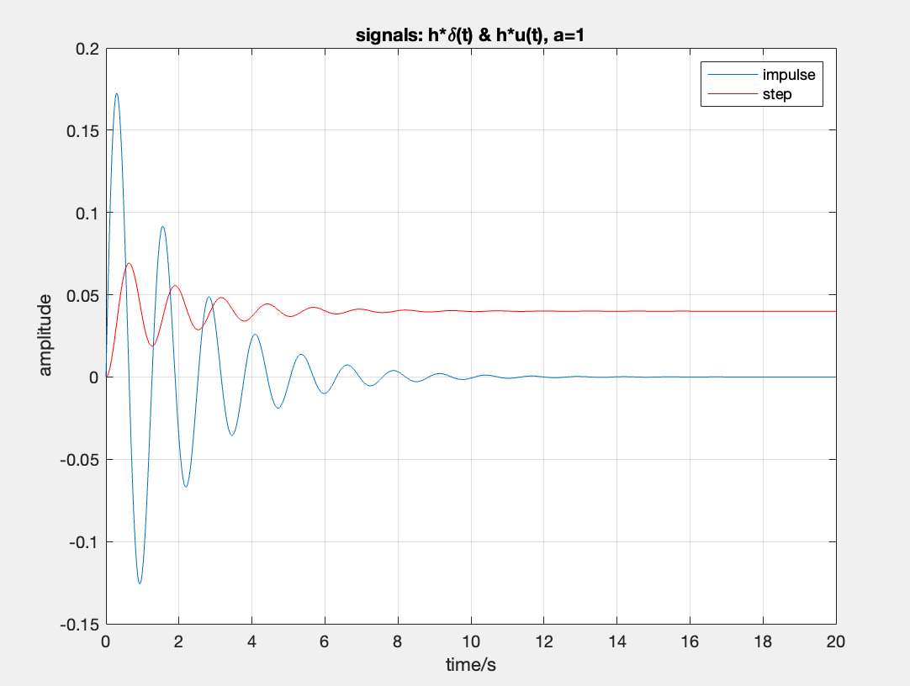
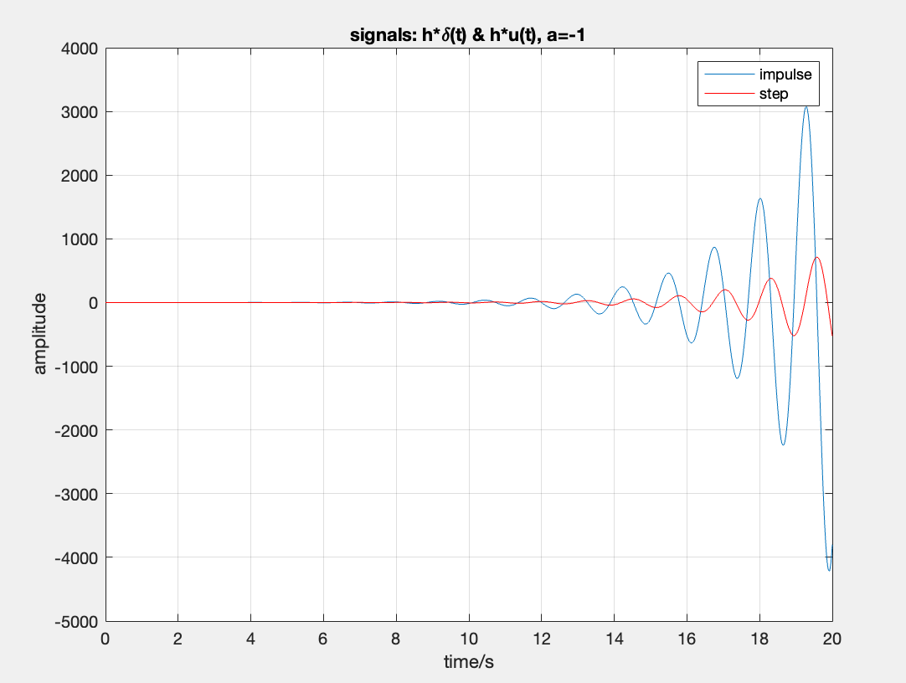

# 实验三

给定一个因果的连续LTI系统的微分方程$y''(t)+ay'(t)+25y(t)=x(t), a=\pm 1$.

## 理论计算

### (1) 系统的传输函数、零点和极点，判断系统的稳定性

首先计算$H(s)$:

$$
y''(t)\pm y'(t)+25y(t)=x(t)\\
s^2Y(s)\pm sY(s)+25Y(s)=X(s)\\
H(s)=\frac{Y(s)}{X(s)}=\frac{1}{s^2\pm s+25}=\frac{1}{(s-\frac{\mp 1+j3\sqrt{11}}{2})(s-\frac{\mp 1-j3\sqrt{11}}{2})}\\
=\frac{1}{j3\sqrt{11}}(\frac{1}{s-\frac{\mp 1+j3\sqrt{11}}{2}}+\frac{-1}{s-\frac{\mp 1-j3\sqrt{11}}{2}})
$$

可见$H(s)$有极点$\frac{\mp 1+j3\sqrt{11}}{2}, \frac{\mp 1-j3\sqrt{11}}{2}$, 分类讨论:

1. 当方程为$y''(t)+ y'(t)+25y(t)=x(t)$时, 两个极点都在$z=0$右边, 又因为是因果系统, $h(t)$为右边信号, 所以ROC包含虚轴, 故稳定.
2. 当方程为$y''(t)- y'(t)+25y(t)=x(t)$时, 两个极点都在$z=0$左边, 又因为是因果系统, $h(t)$为右边信号, 所以ROC不包含虚轴, 故不稳定.

### (2) 求系统的单位冲激响应和单位阶跃响应

#### I 单位冲激响应

$$
\begin{aligned}
h(t)*\delta(t) \xleftrightarrow\mathcal{L}H(s) \cdot 1 
&= \frac{1}{s^2\pm s+25} \\
&= \frac{1}{(s\pm\frac12)^2+(\frac32\sqrt{11})^2} \\
\end{aligned} \\

\begin{aligned}
h(t)*\delta(t) 
&= \frac2{3\sqrt{11}}e^{\mp\frac12t}\sin(\frac32\sqrt{11}t)u(t)
\end{aligned}
$$

#### II 单位阶跃响应

$$
\begin{aligned}
h(t)*u(t) \xleftrightarrow\mathcal{L}H(s)\cdot\frac1s
&= \frac1s\cdot\frac{1}{s^2\pm s+25} \\
&= \frac1{25}(\frac1s-\frac{s\pm1}{s^2\pm s+25}) \\
&= \frac1{25}(\frac1s-\frac{s\pm\frac12}{(s\pm\frac12)^2+(\frac32\sqrt{11})^2}-\frac{\pm\frac12}{(s\pm\frac12)^2+(\frac32\sqrt{11})^2}) \\
\end{aligned} \\
\begin{aligned}
h(t)*u(t) 
&= \frac1{25}(1-e^{\mp\frac12t}\cos(\frac32\sqrt{11}t)-e^{\mp\frac12t}\frac{\pm 1}{3\sqrt{11}}\sin(\frac32\sqrt{11}t))u(t) \\
\end{aligned}
$$

### (3) 求以上响应的初值和终值

#### I 单位冲激响应

$$
初值: h*\delta(0^+)=0\\
终值: \lim_{t\rightarrow\infty} h*\delta(t)=
\begin{cases}
0 & a=+1 \\
发散 & a=-1
\end{cases}\\
$$

#### II 单位阶跃响应

$$
初值: h*u(0^+)=0\\
终值: \lim_{t\rightarrow\infty} h*u(t)=
\begin{cases}
\frac{1}{25} & a=+1 \\
发散 & a=-1
\end{cases}\\
$$

## 仿真分析

### (1) 绘制系统的零极点图

```matlab
a = -1; % 控制正负号

num = 1;          % 分子系数
den = [1, a, 25]; % 分母系数
zs = roots(num);  % 零点集
ps = roots(den);  % 极点集

% 输出零极点图
figure(1)
plot(real(zs), imag(zs), 'or');
plot(real(ps), imag(ps), 'xr');
title(['Pole-Zero Plot, a=', num2str(a)]);
xlabel('Re');
ylabel('Im');
grid on;
```


可见与之前计算的极点坐标符合.

### (2) 画出系统单位冲激响应和单位阶跃响应的波形

使用matlab的impulse和step函数

```matlab
t = 0: 0.01: 20;          % 在时域上的采样点
h = impulse(num, den, t); % 单位冲击响应
s = step(num, den, t);    % 单位阶跃响应

% 输出单位冲击响应&单位阶跃响应的时域波形
figure(2);
plot(t,h); 
hold on;
plot(t,s,'r'); 
hold off;
title(['signals: h*\delta(t) & h*u(t), a=', num2str(a)]);
xlabel('time/s');
ylabel('amplitude');
legend('impulse','step');
grid on;
```





### (3) 由仿真结果验证理论分析结论FUCK比较主观, 可以改改

由仿真结果可见,

$a=+1$时: 单位冲激响应初值为0, 终值为0; 单位阶跃响应初值为0, 终值为0.04左右, 和理论值$\frac{1}{25}$几乎无偏差;

$a=-1$时: 单位冲激响应初值为0, 终值发散; 单位阶跃响应初值为0, 终值发散.

仿真结果和理论分析结论可以在极小误差范围内被认为一致, 同时a的取值也验证了系统的稳定性或不稳定性, 因此理论分析结论得到验证.

### (4) 还有什么见解?FUCK太鸡把主观了, 必须改改

这个LTI提供了一个终值定理的限制的例子, 即终值定理仅适用于稳定系统, 若系统有极点在虚轴或右半平面, 则终值定理失效. 这里$a=-1$时的$\lim_{t\rightarrow\infty}h*\delta(t)\neq\lim_{s\rightarrow0}sH(s)=\frac{1}{25}$.

例子也体现了极点位置与稳定性的影响, 对于因果系统, 如果在复平面的右半边有极点, 则是非稳定系统; 如果在复平面的右半边无极点, 则是稳定系统.
